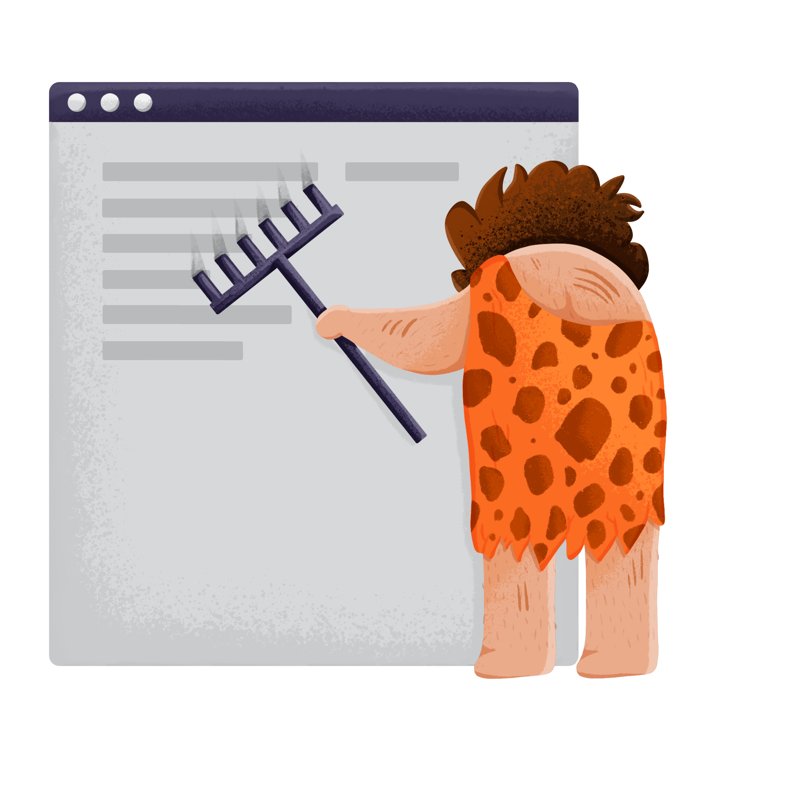

# Primitive Scrape

A primitive Chrome extension to scrape data from websites as you visit them.

--------------------

## What is this?

If you've ever wanted to scrape some data off of the web, then you have probably encountered a million different tools to spawn workers and scrape 1000 URLs per second.

But, what if you don't want that? 
What if you just want to scrape a few pages, or just one page at a time, or scrape pages in an uncertain order, or scrape pages without setting up complicated scripts? 

Where is the tool to help you do that? Where is the tool for the simple scraper, the primitive man?

**It's here!** Primitive Scrape helps you scrape web pages without setting up complicated scripts, without spawning workers, and without getting blocked by anti-scraping systems.

## How it works

When you visit a webpage, the content of that webpage is sent to your computer and stored by your wbe browser (Chrome in this case).
Once that happens, you can do whatever you want with that web content! 
Most people prefer to just view it like a normal user, but some people might want to extract data from it.

Generally, website owners don't want people to extract data from their websites. 
They will pay entities money in order to block normal web scraping systems.
They can detect these web scraping systems in a number of ways, but usually they do monitoring in order to determine if the entity requesting to load a web page is "human" or a "bot".

By acting as a Chrome extension, Primitive Scrape takes advantage of the fact that you are a human! 
Systems that try to block "bots" won't block you, because you aren't a bot.
Using that advantage, you can go to any number of pages, just as your normally do, and extract data from them without any fear.

## Where can I get this?

You can download it from the Chrome web store here: [TODO]

## I'm a developer who to [Explore documentation, build from source, etc.]

Documentation for developers can be found here: [TODO]